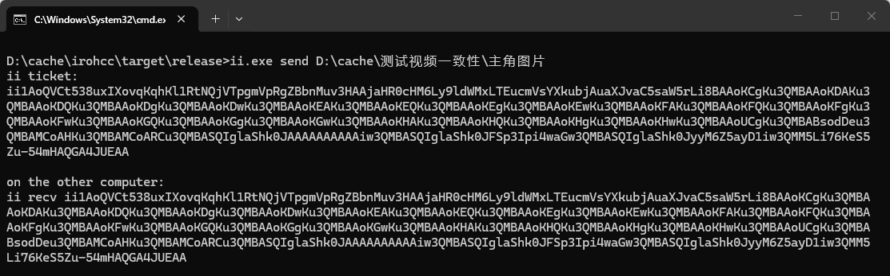
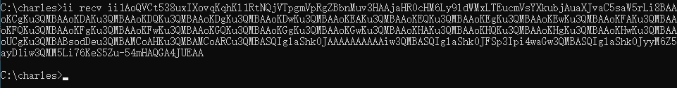

<p align="center">
  
</p>

<h1 align="center">ii</h1>

<p align="center">
  A cross-platform file transfer CLI for quickly sending files, folders, and piped data.
</p>

<p align="center">
  <a href="https://github.com/zengyufei/ii/releases"></a>
  <a href="LICENSE"></a>
  
  
</p>

<p align="center">
  <a href="README.md">简体中文</a> · <strong>English</strong>
</p>

`ii` is built for temporary file transfer:

- The sender serves one successful receive by default, then exits
- It briefly probes for a usable path through complex networks
- Receives resume automatically by default
- Existing files with the same MD5 are skipped
- Folders can be sent directly

## Quick Start

Run this on the sender:

```powershell
ii send .\video.mp4
```

`ii` prints a ticket:

```text
ii ticket:
ii1k7v...x9a

on the other computer:
ii recv ii1k7v...x9a
```

Run this on the receiver:

```powershell
ii recv ii1k7v...x9a
```

## Common Scenarios

Send a temporary file to a coworker:

```powershell
ii send .\report.pdf
ii recv ii1k7v...x9a
```

What the sender and receiver look like:





Choose an output directory:

```powershell
ii recv ii1k7v...x9a -o D:\Downloads
```

If the network drops halfway, run the same `ii recv` command again and it continues receiving. If the target file already exists with the same content, it is skipped. If the name matches but the content differs, it is overwritten.

`ii send` and `ii recv` both show live transfer progress and speed in the terminal, then print the final elapsed time when done. `--trace` switches to diagnostic output so you can see where the delay comes from.

## Send Folders

Folders can be sent directly:

```powershell
ii send .\my-folder
```

Receiver:

```powershell
ii recv ii1k7v...x9a -o D:\Downloads
```

The result is `D:\Downloads\my-folder`, not a duplicated `my-folder\my-folder` nesting.

## Advanced Usage

The sender serves one receiver by default. Use `-t` to keep it running:

```powershell
ii send .\my-folder -t
```

Copy the receive command to the clipboard:

```powershell
ii send .\video.mp4 -c
```

Write the receive command to a file:

```powershell
ii send .\video.mp4 -o recv.txt
```

Send from stdin:

```powershell
tar czf - .\project | ii send --name project.tar.gz
```

Receive to stdout:

```powershell
ii recv ii1k7v...x9a --stdout > project.tar.gz
```

Prefer local network paths and avoid public relays:

```powershell
ii send .\file.zip --local
ii recv ii1k7v...x9a --local
```

Use WebDAV as a transfer backend:

```powershell
ii send .\video.mp4 --webdav
ii recv ii1k7v...x9a
```

Select a backend profile:

```powershell
ii send .\video.mp4 --s3 --profile work
ii send .\video.mp4 --webdav --profile nas
```

If the receiver has no WebDAV config, create a portable ticket:

```powershell
ii send .\video.mp4 --webdav -p
```

`-p` writes the WebDAV URL, username, and password into the ticket. It is convenient but unsafe, so use it only when you trust the ticket recipient.

After a successful receive, the WebDAV config from a `-p` ticket is written to the receiver's local `ii.toml`. To remove the WebDAV object after receive, add `-d`:

```powershell
ii send .\video.mp4 --webdav -p -d
```

## Diagnostics

Trace why a receive is slow:

```powershell
ii recv ii1k7v...x9a --trace
ii recv ii1k7v...x9a --local --trace
```

Check local networking, ports, permissions, and version information:

```powershell
ii doctor
ii version
```

## Self-hosted Relay

You do not need to understand relay hosting to send ordinary files. This section is only for running your own relay service or using a fixed relay entrypoint in a company network.

Start a relay:

```powershell
ii relay
```

The default is an HTTP-only relay:

- It listens on `0.0.0.0:3340`; only allow `3340/tcp`.
- Use the server's public IP directly. No domain, DNS, or certificate is required.
- HTTPS, QUIC, and metrics do not start.

Clients use it with:

```powershell
ii send .\video.mp4 --relay http://SERVER_PUBLIC_IP:3340
```

For HTTPS and a domain, explicitly provide an existing certificate and private key:

```powershell
ii relay --tls relay.example.com -H 8443 --cert D:\certs\fullchain.pem --key D:\certs\privkey.pem
```

Clients use `https://relay.example.com:8443`. `ii` does not issue or renew certificates; the operator owns those files. See [ii.md](ii.md) for the full configuration. Plain HTTP is not suitable for a long-lived public deployment.

## Full Manual

The full command reference, port roles, TLS sources, config paths, diagnostics, and implementation mapping are documented in [ii.md](ii.md).

## Changelog

Release changes are documented in [CHANGELOG.en.md](CHANGELOG.en.md). The default Chinese version is [CHANGELOG.md](CHANGELOG.md).

## Version

The current version is managed by Git tags. This repository currently uses `v0.1.10`.

## License

This project uses the MIT License. You can use, modify, and distribute it freely. See [LICENSE](LICENSE).
