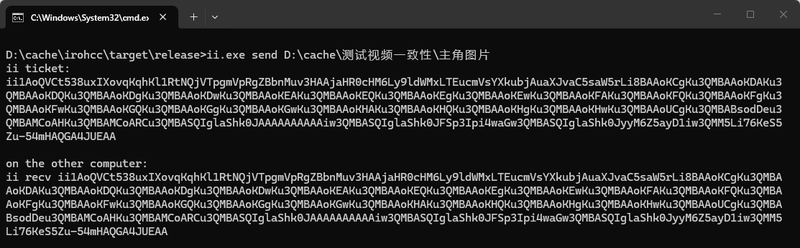
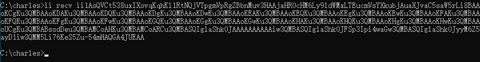

<p align="center">
  
</p>

<h1 align="center">ii</h1>

<p align="center">
  一个跨平台文件传输 CLI，用来快速发送文件、目录和管道数据。
</p>

<p align="center">
  <a href="https://github.com/zengyufei/ii/releases"></a>
  <a href="LICENSE"></a>
  
  
</p>

<p align="center">
  <strong>简体中文</strong> · <a href="README.en.md">English</a>
</p>

`ii` 面向临时传文件/夹：

直发目录 / 一次即走 / 持续发送 / 自动复制到粘贴板或落盘

自动找路 / 局域网优先 / 可公网中继或 `--s3` / `--webdav` / `--ftp` / `--sftp` 中继

也可用 `ii send <文件或文件夹> --web` 临时开下载页、`ii web [目录]` 浏览局域网目录、`ii webrtc` 让浏览器局域网直传文件，或用 `ii tunnel` 临时转发 TCP 端口

断点续收 / 秒传跳过 / 冲突覆盖 / 支持传完清理中转

进度速率 / 完成耗时 / 支持诊断本机 / 支持自建中继

## 快速开始

在发送端执行：

```powershell
ii send .\video.mp4
```

`ii` 会输出一段 ticket：

```text
ii ticket:
ii1k7v...x9a

on the other computer:
ii recv ii1k7v...x9a
```

在接收端执行：

```powershell
ii recv ii1k7v...x9a
```

## 常见场景

同事之间临时传一个文件：

```powershell
ii send .\report.pdf
ii recv ii1k7v...x9a
```

发送端和接收端的实际样子：





指定保存目录：

```powershell
ii recv ii1k7v...x9a -o D:\Downloads
```

断网或传到一半失败后，重新执行同一条 `ii recv` 就会继续接收；如果目标文件已经完整且内容相同，会直接跳过；如果同名但内容不同，会覆盖。

`ii send` 和 `ii recv` 都会在终端里实时显示传输进度和速率；完成后会打印最终耗时。`--trace` 主要用于诊断，方便排查连接慢在哪里。

## 发送目录

目录可以直接发送：

```powershell
ii send .\my-folder
```

接收端：

```powershell
ii recv ii1k7v...x9a -o D:\Downloads
```

接收结果是 `D:\Downloads\my-folder`，不会变成 `my-folder\my-folder` 两层。

## 进阶用法

默认发送端只服务一次接收。需要保持发送端不退出时，用 `-t`：

```powershell
ii send .\my-folder -t
```

复制接收命令到剪贴板：

```powershell
ii send .\video.mp4 -c
```

把接收命令写到文件：

```powershell
ii send .\video.mp4 -o recv.txt
```

从 stdin 发送：

```powershell
tar czf - .\project | ii send --name project.tar.gz
```

接收到 stdout：

```powershell
ii recv ii1k7v...x9a --stdout > project.tar.gz
```

临时开局域网下载页：

```powershell
ii send .\video.mp4 --web
ii send .\my-folder --web
ii send .\video.mp4 --web --port 8080
ii send .\video.mp4 --web --token
ii send .\video.mp4 --web --token A1b2C3d4E5f6G7h8
ii send .\video.mp4 --web --upload --path .\uploads
ii web
ii web .\shared --port 8080 --token A1b2C3d4E5f6G7h8 --upload --path .\uploads
ii webrtc
ii webrtc --port 8080 --token A1b2C3d4E5f6G7h8
ii tunnel -s 127.0.0.1:22
```

命令行会在主局域网 URL 上方显示进入下载页的二维码，并在 `other:` 下列出其余物理和虚拟网卡的 IPv4 URL；下载页顶部的二维码则直达 `/download`，方便手机扫码下载。网页默认只读；传入 `--upload` 后才显示多文件上传并开放上传接口，默认写到启动命令当前目录的 `./ii/`。可用 `--path <目录>` 改为直接写入指定目录，相对路径仍以启动目录为基准，目录会在首次上传时创建；不带 `--upload` 的 `--path` 会被忽略。不支持上传目录。目录会下载为 `.tar`。按 `Ctrl+C` 关闭服务。`--port <端口>` 指定 `1` 到 `65535` 的监听端口；不带时由系统随机选择。裸 `--token` 会生成并在终端 URL 中打印 32 字符路径访问令牌；也可用 `--token <value>` 或 `--token=<value>` 指定令牌，值只能是 16 到 128 个 ASCII 字母、数字、`-` 或 `_`。不带 `--token` 时保持无令牌 URL。该模式没有账号鉴权，只适合临时、可信的局域网。

`ii web` 不带路径时服务启动命令的当前目录；带路径时只接受已有目录。网页默认提供 nginx 风格的递归目录浏览和普通文件访问；传入 `--upload` 后才提供多文件上传。终端输出同样有二维码、主 IPv4 LAN URL 与 `other:` 网卡 URL，但目录网页不显示二维码。`--port`、`--token`、`--upload` 与 `--path` 的规则和 `ii send ... --web` 相同，`-p` 不适用于 `ii web`。

`ii webrtc` 开一个局域网浏览器直传房间。终端输出二维码、主 IPv4 LAN URL 与 `other:` 网卡 URL；打开同一 URL 的浏览器会自动显示为临时设备编号，可选择另一个在线设备并发送多个独立文件或文本消息。文本只发送给当前选中的设备，长文本按 UTF-8 字节以不超过 1 MiB 的分片传输，接收端重组后在当前页面列表显示，并可逐条复制；刷新页面后列表清空，不保存聊天记录。文件通过浏览器 WebRTC DataChannel 两端直传，不经过 `ii` 进程，也不会写入启动机器。页面会先实际测试浏览器能否创建 ICE host candidate；浏览器禁用或阻止 WebRTC 时会显示 `WebRTC unavailable`，不会加入房间。它只交换局域网 host candidates，不使用公网 STUN/TURN；网络隔离、防火墙或禁止 P2P 时会连接失败。接收端自动下载，但会先把单个文件聚合在浏览器内存中，因此不适合超出设备可用内存的大文件。可选 `--port <端口>` 指定 `1` 到 `65535` 的监听端口，不带时随机选择；裸 `--token` 自动生成路径令牌，也可用 `--token <value>` 指定。完整说明见 [webrtc.md](webrtc.md)。

临时转发服务端可访问的 TCP 端口：

```powershell
# A: 让持有 ticket 的设备访问 A 可连接的 SSH、NAS 或开发服务
ii tunnel -s 127.0.0.1:22

# B: 使用 A 输出的 ticket；默认监听 127.0.0.1:8080，8080 被占用会自动试下一个端口
ii tunnel -c ii1k7v...x9a

# B: 明确暴露给 B 所在局域网的其他设备
ii tunnel -c ii1k7v...x9a --listen 0.0.0.0:8022
```

本机连接 B 的监听端口，流量会经 Iroh 加密连接送到 A，再由 A 连接目标 TCP 端口。直连失败时默认可用 Iroh relay；自建公网 relay 时，在 A 上指定它，ticket 会把 relay 和自签信任策略带给 B：

```powershell
ii relay --port 8443
ii tunnel -s 192.168.1.10:5000 --relay http://公网IP:8443
```

relay 只转发加密 Iroh 流量，不会把目标 TCP 端口直接开放到公网。ticket 内含本次 tunnel 的访问密钥，持有者可接入直到 A 停止服务，不要泄露。首版只支持 TCP。

局域网优先，不走公网中继：

```powershell
ii send .\file.zip --local
ii recv ii1k7v...x9a --local
```

通过 S3/R2 中转：

```powershell
ii send .\video.mp4 --s3
ii recv ii1k7v...x9a
```

首次使用会在命令行里提示填写 Cloudflare R2 配置，成功后写入本机 `ii.toml`，以后直接复用。

通过 WebDAV 中转：

```powershell
ii send .\video.mp4 --webdav
ii recv ii1k7v...x9a
```

通过 FTP 或 SFTP 中转：

```powershell
ii send .\video.mp4 --ftp
ii send .\video.mp4 --sftp
ii recv ii1k7v...x9a
```

FTP 只支持明文 `ftp://`，账号、文件和控制命令都可能被网络上的人读取。SFTP 支持密码和 SSH 私钥认证；每次连接会显示并自动接受服务器的 SSH SHA-256 主机指纹。

选择指定后端 profile：

```powershell
ii send .\video.mp4 --s3 --profile work
ii send .\video.mp4 --webdav --profile nas
ii send .\video.mp4 --ftp --profile legacy
ii send .\video.mp4 --sftp --profile server
```

如果接收方没有后端配置，可以用便携 ticket：

```powershell
ii send .\video.mp4 --webdav -p
ii send .\video.mp4 --ftp -p
ii send .\video.mp4 --sftp -p
```

`-p` 会把 WebDAV/FTP 的 URL、用户名和密码写进 ticket；SFTP 密码 ticket 会写入密码，SFTP 私钥 ticket 会写入私钥文本和口令。ticket 只有编码，没有加密，方便但不安全，只适合你信任 ticket 接收方的场景。

接收成功后，`-p` ticket 内的配置会写入接收端本机 `ii.toml`；便携 SFTP 私钥会保存为独立密钥文件，配置中只保存路径。如果希望接收后清理后端对象，可以加 `-d`：

```powershell
ii send .\video.mp4 --webdav -p -d
ii send .\video.mp4 --sftp -p -d
```

SFTP 私钥 profile 示例：

```toml
[storage.sftp.server]
host = "sftp.example.com"
port = 22
username = "ii"
remote_dir = "ii/"
auth = "private-key"
private_key_path = "C:\\Users\\you\\.ssh\\id_ed25519"
private_key_passphrase = "optional-passphrase"
```

## 图形界面

Release 同时提供 `ii-gui`。它复用 `ii` 的传输逻辑，支持默认自动路径、仅局域网、指定 HTTPS relay、S3 和 WebDAV，并保存本机传输队列和这些 profile。FTP/SFTP 目前只在 CLI 中提供。

## 诊断

排查为什么慢：

```powershell
ii recv ii1k7v...x9a --trace
ii recv ii1k7v...x9a --local --trace
```

检查本机网络、端口、权限和版本信息：

```powershell
ii doctor
ii version
```

## 自托管 Relay

普通发文件不需要先理解 relay。只有你要自建中继服务，或者公司网络环境需要固定中继入口时，才需要看这一段。

直接启动 HTTP relay：

```powershell
ii relay
```

默认监听 `0.0.0.0` 的随机空闲端口，终端会打印主网卡 URL 和 `other:` 下的其余 IPv4 网卡 URL。`0.0.0.0` 仅用于监听，不能作为客户端地址；客户端使用实际可达的局域网 IP 或公网 IP 加打印出的端口。云服务器的公网 IP 可能由 NAT 提供，不一定出现在网卡列表中。

固定端口：

```powershell
ii relay --port 8443
```

发送端指定 HTTP relay：

```powershell
ii send .\video.mp4 --relay http://服务器公网IP:8443
```

需要 HTTPS 时由 `ii` 自动生成当前进程使用的自签证书：

```powershell
ii relay --tls --port 8443
ii send .\video.mp4 --relay https://服务器公网IP:8443 -k
```

`-k` 只用于 HTTPS，表示跳过该 relay 的证书校验，并把该策略带进 ticket；接收方无需安装证书或配置 relay。首次连接仍可能遭遇中间人替换。

自签 TLS 需要域名显示时：

```powershell
ii relay --tls --domain relay.example.com --port 8443
ii send .\video.mp4 --relay https://relay.example.com:8443 -k
```

已有 PEM 证书时，使用手工证书替换自签证书：

```powershell
ii relay --tls --domain relay.example.com --port 8443 --cert D:\certs\fullchain.pem --key D:\certs\privkey.pem
ii send .\video.mp4 --relay https://relay.example.com:8443
```

手工证书模式不带 `-k`，客户端使用系统正常 TLS 校验。HTTP 或 HTTPS 的 `--relay` 都只走 relay-only，不尝试 UDP 或直连；完整端口、TLS 和公网 NAT 边界见 [ii.md](ii.md)。FTP 和 SFTP 的配置、ticket 和安全限制分别见 [ftp.md](ftp.md) 与 [sftp.md](sftp.md)。

## 详细手册

完整命令、端口职责、TLS 来源、配置路径、故障排查和底层对应关系都写在 [ii.md](ii.md)。

## 变更记录

版本变更见 [CHANGELOG.md](CHANGELOG.md)。英文版本见 [CHANGELOG.en.md](CHANGELOG.en.md)。

## 版本

当前版本由 Git tag 管理。仓库内已使用 `v0.1.15`。

## 许可证

本项目使用 MIT License。你可以自由使用、修改和分发，详见 [LICENSE](LICENSE)。
